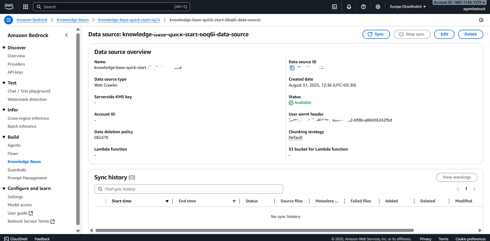

# 🚀 AWS Agent + Knowledge Base + Guardrails + Streamlit 

This project demonstrates how to build a **Generative AI Agent** on AWS using **SageMaker Agents, Knowledge Base, Guardrails**, and then integrate with **CrewAI** and deploy with a **Streamlit UI**.

---

## 📌 Project Overview

The workflow involves:
1. Creating an **Agent** in AWS SageMaker.
2. Setting up a **Knowledge Base** (with website crawl tool).
3. Adding **Guardrails** for responsible AI outputs.
4. Preparing the Agent with Knowledge Base + Guardrails.
5. Creating an **Agent Alias** for versioning.
6. Integrating the Agent with **Python (boto3)** + **CrewAI agents**.
7. Deploying a frontend using **Streamlit**.

---

## 🖼️ System Architecture

```mermaid
flowchart TD
    %% User Layer
    U[👩‍💻 User] --> S[🌐 Streamlit UI]

    %% CrewAI Agents
    S --> C1[Technology Architect Agent]
    S --> C2[Compliance Analyst Agent]
    S --> C3[Compliance Specialist Agent]

    C1 --> P[⚙️ CrewAI Process]
    C2 --> P
    C3 --> P

    P --> T1[Task 1: Compliance Analysis]
    P --> T2[Task 2: Compliance Reporting]
    P --> T3[Task 3: Solution Design]

    %% AWS Bedrock Integration
    P --> B[Amazon Bedrock]

    B --> BA[Amazon Bedrock Agents]
    BA --> KB[Amazon Bedrock Knowledge Bases]
    B --> GR[Amazon Bedrock Guardrails]
    B --> LLM[LLM Models]
```

## 🛠️ Steps Implemented

### 1. Create an Agent in SageMaker
- Created an **Agent** that serves as the core LLM workflow manager.
- Configured the agent with base LLM model.
- Purpose: Acts as the entry point for all queries.

📷  

---

### 2. Set up a Knowledge Base
- Used **AWS Knowledge Base** with **Website Crawl Tool**.
- Crawled target website(s) and indexed documents.
- Purpose: Provides contextual answers to user queries.

📷 **

---

### 3. Add Guardrails
- Configured **Guardrails** for:
  - Filtering unsafe content.
  - Restricting harmful responses.
  - Enforcing compliance rules.
- Purpose: Ensure responsible AI behavior.

📷 **

---

### 4. Prepare the Agent
- Linked **Agent + Knowledge Base + Guardrails**.
- Ensured queries first pass through Guardrails.
- Validated integration with test prompts.

---

### 5. Create Agent Alias
- Created an **Alias** for the agent.
- Purpose: Maintain stable endpoint for applications even when upgrading versions.

---

### 6. Integrate with Python (boto3) + CrewAI Agents
- Wrote **Python boto3 code** to invoke the agent.
- Connected the agent with **CrewAI Agents** for orchestration.
- Tested multiple demo queries.

---

### 7. Deploy Streamlit Frontend
- Built a **Streamlit App** for user-friendly interface.
- Added:
  - Input box for queries.
  - Output panel for agent responses.
  - Demo questions for first-time users.
- Purpose: Interactive and easy to demo.

📷 **

---

## 💡 Example Demo Questions

To help new users understand the agents, we added some sample queries:

- **Agent (SageMaker):**
  - "What is this agent’s role?"
  - "How does the agent fetch responses?"
- **Knowledge Base:**
  - "What content is this knowledge base built on?"
  - "Can you summarize information from the crawled site?"
- **Guardrails:**
  - "What happens if I ask something unsafe?"
- **Streamlit:**
  - "How do I interact with the deployed agent?"

---

## ⚙️ Tech Stack
- **AWS SageMaker** (Agent, Alias)
- **AWS Knowledge Base** (Website crawl tool)
- **AWS Guardrails**
- **Python (boto3)**
- **CrewAI Agents**
- **Streamlit**

---

## 🚀 Deployment Flow

1. Create Agent → 2. Build Knowledge Base →  
3. Add Guardrails → 4. Prepare Agent →  
5. Create Alias → 6. Python + CrewAI Integration →  
7. Streamlit Deployment  

---

## 📖 Next Steps / Improvements
- Add more connectors to Knowledge Base (PDF, DB, S3).
- Enhance UI with chat history in Streamlit.
- Add monitoring and logging with CloudWatch.

---

## 🧑‍💻 Author
Built by **Arun Shukla**  
- [GitHub](https://github.com/anshu1016)  
- [LinkedIn](https://www.linkedin.com/in/anshu1016)  
- [Medium](https://medium.com/@arunshukla98710)  

